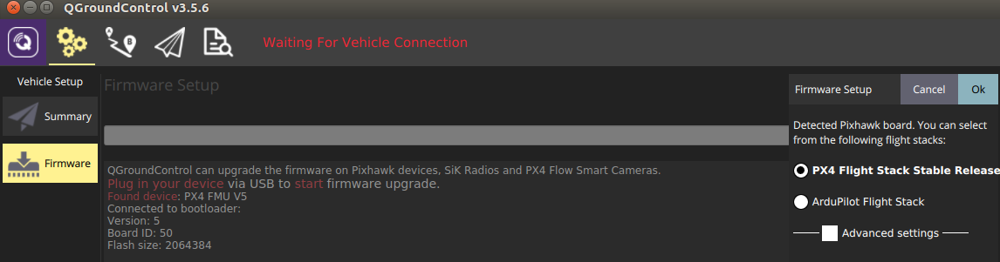

# Control of Networked Systems (CNS) - Flight Manual

[](./LICENSE)

This README briefly describes how a UAV with a Pixhawk flight computer is setup at the [Control of Networked Systems Group (CNS)](https://www.aau.at/en/smart-systems-technologies/control-of-networked-systems/) at the University of Klagenfurt. This setup also provides the essential steps for the base setup of the [CNS flight stack](https://github.com/aau-cns/flight_stack). The only settings which might need to be adapted for another vehicle (besides the TWINS flight platform) are the assignments of the Mavlink serial ports within the settings file described below.

* This Repository provides all settings files and the extras.txt file, which will be copied to the SD card.

* Minimal instructions on how to setup and modify a catkin workspace with CNS modified packages are provided by [px4_firmware_catkin_ws_build.md](./px4_firmware_catkin_ws_build.md).

* A short manual on how the Optitrack-System at the Dronehall is configured is shown by [optitrack.md](./optitrack.md)

## First-time TWINS Setup and Motion Capture Closed-Loop Flight

### Flashing the Stock PX4 Firmware

1. Download QGroundControl [from here](https://docs.qgroundcontrol.com/master/en/getting_started/download_and_install.html)
   * Note: We are using version 3.5.6 because it still provides the "Widgets"
2. Start QGroundControl, in the `Vehicle Setup`, select the `Firmware` tab
3. Now connect the Pixhawk via USB to the PC
4. Select `PX4 Flight Stack Stable Release` on the top right and press OK (see image below)
5. This will take a moment, and the Pixhawk will beep after the flashing is completed



**Known issues:** Ensure the USB provides enough power; some devices (in power saving mode) do not provide enough power during the flashing process, and the flashing process might stop before completion.

### Upload extras.txt to the SD Card

The `extras.txt` file allows to define the port on which the Mavlink data is streamed and the specification of the rates for specific messages (IMU, GPS, etc.).

1. In the settings bar, choose Widgets -> On-board Files
2. Navigate to (`fs/microsd/etc`), select `etc`, and press the `Upload File` button (see image below)
3. Choose the attached file `./sd_cfg/extras.txt`
4. Restart the PX4 (Tools -> Reboot Vehicle)


**NOTE:** If you can not remove the SD card from the Pixhawk and you have to make changes to the files (move, remove etc.), you can use the "Mavlink Console" which provides rudimentary shell commands (cd, ls, mv, rm).


### Configure the PX4 with QGroundControl

Load the prepared PX4 configuration using QGroundControl. Choose the `Parameters` tab, then click the `Tools` button on the top right and select `Load from file...`.

Locate the file within this folder `./parameter/2020_07_28_twins_one_internal_ekf2.params` and load it.

**Note:** You might see warnings because some parameters were renamed or do not exist between different firmware versions.

After this, restart the PX4 (Tools -> Reboot Vehicle) and double-check the following parameters to ensure that the setup is correct. The loaded parameters will set up the **EKF2** for the internal filter. However, you can choose between the **EKF2** or the **Local Pose Estimator (LPE)** for the internal filter. In any case, verify the parameters for the individual estimator below. The parameters set the individual filter to use an external pose that is subscribed from the rostopic `/mavros/vision_pose/pose`.
Please reboot the vehicle after changing the `SYS_MC_EST_GROUP` parameter to enable the subsequent filter options. You can find the parameters by typing their names in the search bar while you are in the `Parameters` tab.

**EKF2 Settings:**

1. Set `SYS_MC_EST_GROUP` to EKF2 (value 2)
2. Restart the PX4 (Tools -> Reboot Vehicle)
3. Set `EKF2_AID_MASK` to 24 ([x] vision position fusion and [x] vision yaw fusion)
4. Set `EKF2_EVP_NOISE` to 0.1m
5. Set `EKF_EV_DELAY` to 0ms
6. Set `EKF2_HGT_MODE` to Vision

**LPE Setting:**

The LPE position estimator is an extended Kalman filter for 3D position and velocity states.

1. Set `SYS_MC_EST_GROUP` to LPE position estimator (value 1)
2. Restart the PX4 (Tools -> Reboot Vehicle)
3. `LPE_FUSION` - enable vision position, disable baro fusion
4. Set `ATT_EXT_HDG_M` to 1 for vision
5. Set `LPE_VIS_XY` and `LPE_VIS_Z` 0.01 (force-save needed)

This is all that is needed to set up the vehicle.

### Closed-Loop Flight in a Motion Capture Environment

#### ROS Setup

(Skip this step if you are using the [AMADEE catkin workspace](https://github.com/aau-cns/flight_stack.git) or the AMADEE OS)

Prepare your catkin workspace with the following packages:

```sh
git clone https://github.com/aau-cns/ros_vrpn_client.git &&
git clone https://github.com/ethz-asl/vrpn_catkin
```

and install the following packages:

```sh
# Install mavros
apt-get update && apt-get install -y \
    ros-melodic-mavros \
    ros-melodic-mavros-extras

# Download geographiclib
wget https://raw.githubusercontent.com/mavlink/mavros/master/mavros/scripts/install_geographiclib_datasets.sh && \
chmod +x install_geographiclib_datasets.sh

# Install geographiclib
./install_geographiclib_datasets.sh
```

### Additional PX4 Parameter

#### Velocity

You can change the velocity settings for the transition in 3D space. This applies to manual and waypoint flight modes. Especially the default value for the max. vertical descent velocity is too high for the normal use case.

| Parameter          | Description                       | Value      |
| ------------------ | --------------------------------- | ---------- |
| `MPC_XY_VEL_MAX`   | Maximum horizontal velocity       | $0.20 m/s$ |
| `MPC_Z_VEL_MAX_UP` | Maximum vertical ascent velocity  | $0.50 m/s$ |
| `MPC_Z_VEL_MAX_DN` | Maximum vertical descent velocity | $0.50 m/s$ |


#### Return to Land RTL (!Important!)

If the vehicle loses contact or does not receive waypoints within the defined timeout, it will switch into Return to Land mode (RTL). This is a safety feature. However, be sure to adapt the parameters below to reasonable values allowed in your environment. E.g., by default, the vehicle will rise to an altitude of RTL_RETURN_ALT 30 meters before landing. This is dangerous if you are located in an indoor environment that does not allow such heights. The parameters below are an example for an indoor setup.

| Parameter         | Description                                      | Value |
| ----------------- | ------------------------------------------------ | ----- |
| `RTL_RETURN_ALT`  | RTL altitude to fly back to home                 | $2 m$ |
| `RTL_DESCEND_ALT` | Altitude to wait at before landing               | $2 m$ |
| `RTL_LAND_DELAY`  | Time before switching from returning, to landing | $0 s$ |

#### Off-Board Mode

The off-board mode is used for e.g., waypoint following. To ensure uninterrupted communication between the PX4 and a companion board, the `COM_OF_LOSS_T` parameter needs to be increased. The default value of 1 second has shown to be too low; due to this, the PX4 rejects waypoints, especially in the initial phase. Setting `COM_OF_LOSS_T=10s` prevents this issue (see the image below).
| Parameter       | Description            | Value  |
| --------------- | ---------------------- | ------ |
| `COM_OF_LOSS_T` | off-board mode timeout | $10 s$ |


## License

This software is made available to the public to use (_source-available_),
licensed under the terms of the BSD-2-Clause-License with no commercial use
allowed, the full terms of which are made available in the `LICENSE` file.
No license in patents is granted.