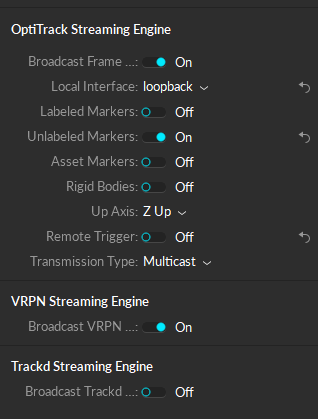
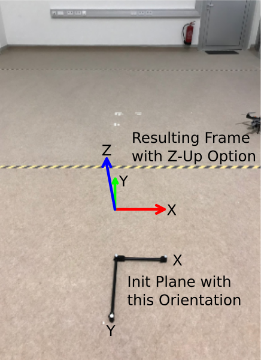
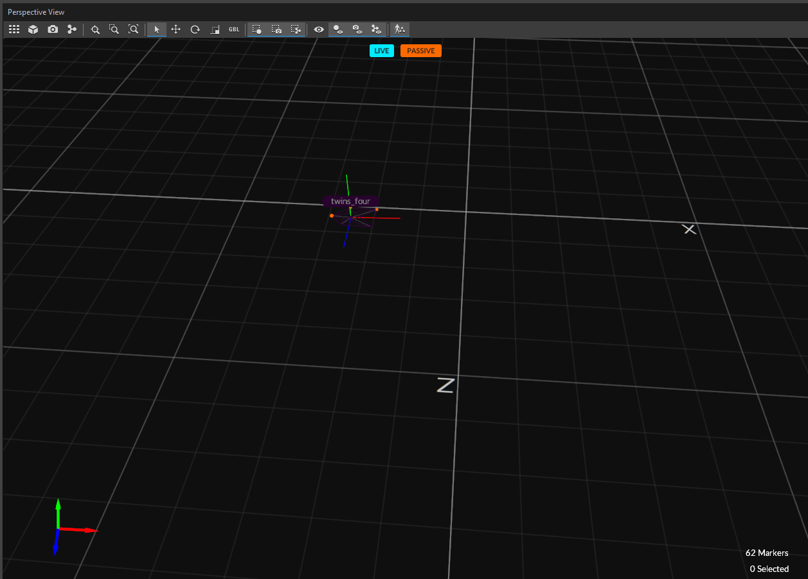
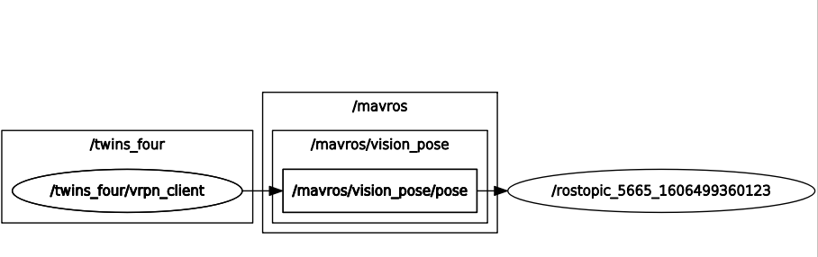
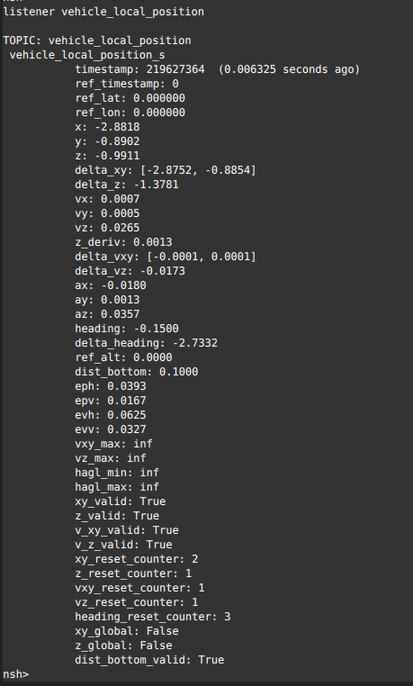

# Dronehall Optitrack Setup

## Optitrack Camera Settings

| Parameter | Value     |
| --------- | --------- |
| Exposure  | $60\mu s$ |
| Threshold | 200       |
| Gain      | 2         |

## Streaming Options

For the Motive streaming/broadcast settings, ensure that the **Up Axis: "Z Up"** option is selected and the **Broadcast VRPN** option is active.



## Optitrack Reference and Vehicle Frame

Using the settings described above, the reference frame used by VRPN and the initialization of the Optitrack system are shown below.



The object/vehicle itself is defined as shown below with the x-axis of the object being aligned with the x-axis of the Optitrack-system and the z-axis of the object pointing up.



## Run MAVROS and VRPN

**Start MAVROS:**

Depending on the platform (Raspberry Pi or Odroid XU4) run:

```sh
roslaunch amadee_bringup px4_pi.launch
# or
roslaunch amadee_bringup px4_xu4.launch
```

**Setup VRPN:**

For this launch file, ensure that:

- the `object_name` matches the name of your Optitrack object
- the `vrpn_coordinate_system` is set to "vicon" and
- the `vrpn_server_ip` is correct

**Example:**

```xml
<arg name="object_name" default="your_object_name" />
...
<param name="vrpn_server_ip" value="192.168.0.107" />
<param name="vrpn_coordinate_system" value="vicon" />
```

**Remap the VRPN topic to the PX4 topic**

```xml
<remap from="/your_object_name/vrpn_client/raw_pose" to="/mavros/vision_pose/pose"/>
```

**Start the VRPN client:**

```sh
roslaunch amadee_bringup optitrac_dronehall.launch
```

After launching both nodes, ensure the correct remapping of the topics, `rqt_graph` should show you the graph below:



**IMPORTANT:** Ensure that the internal PX4 estimator is publishing a pose that you expect. For this, use the MAVLINK console and run `listener vehicle_local_position`. You should see information similar to the output in the image below. Please note that the coordinates of the object, as defined in the previous section, are expressed in an **ENU** Frame which is expected by MAVROS. However, `listener vehicle_local_position` will show coordinates in **NED**.


